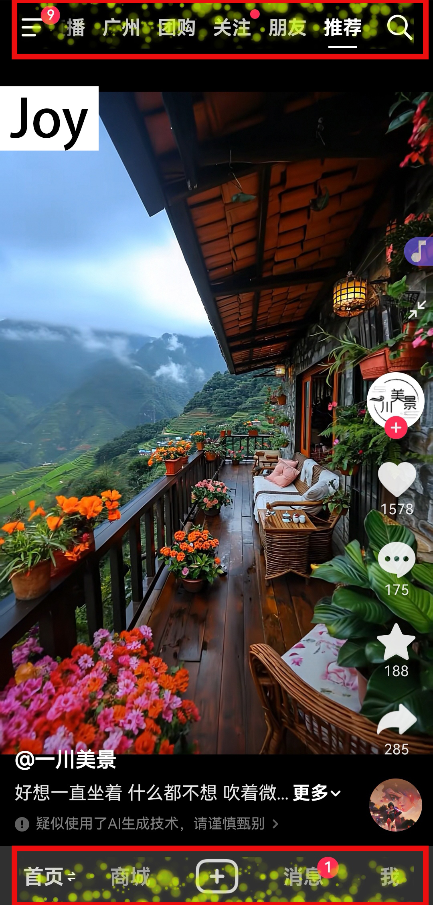
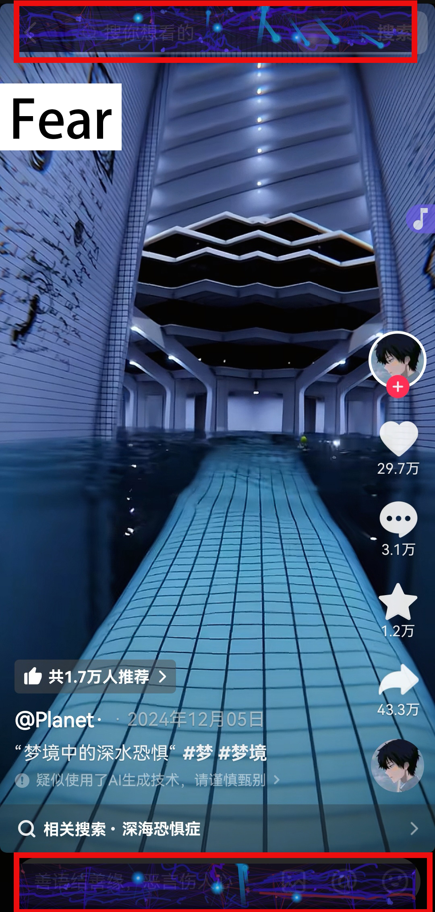
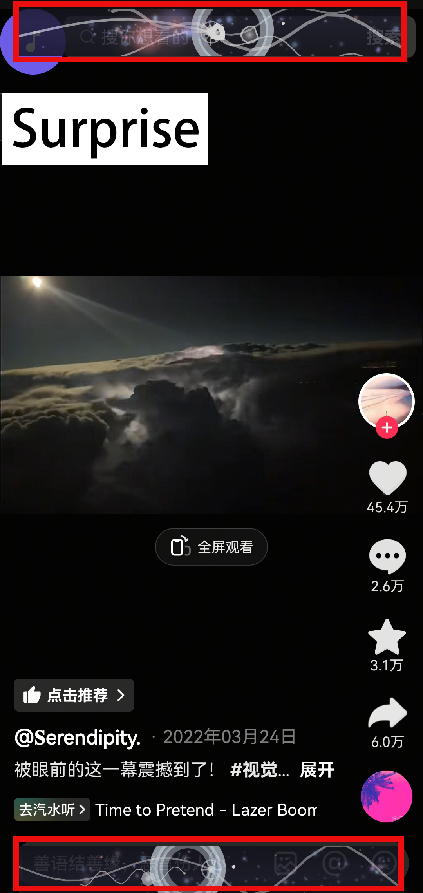
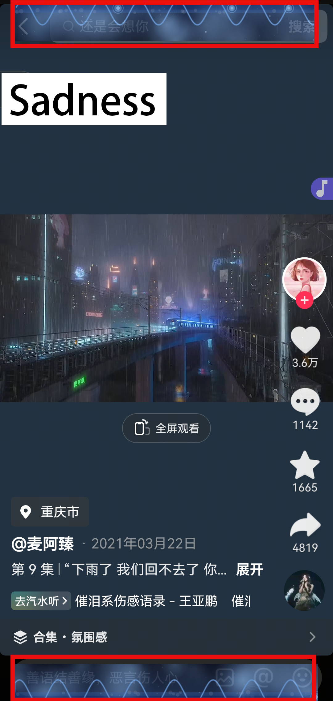
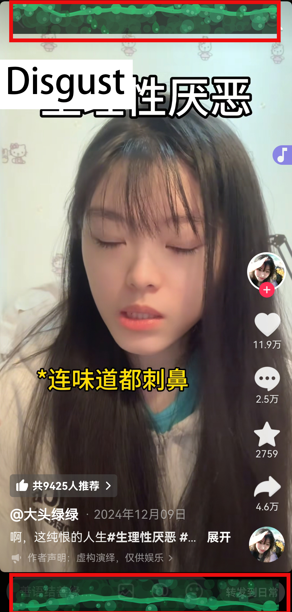
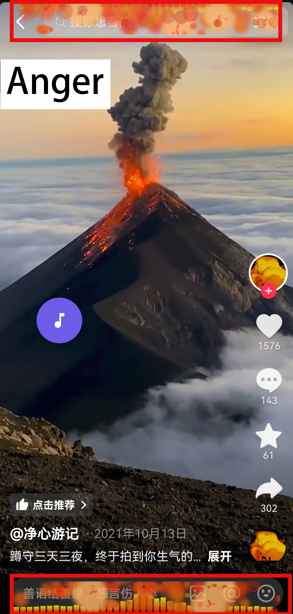
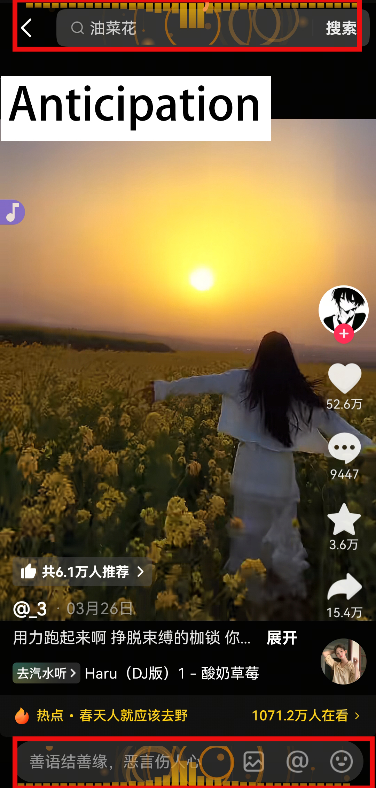

# Visual Effects Description

## 1. Joy

  

### Overall Visual Concept
Like yellow particles rising in sunlight. These light particles float freely, converge, and disperse with the musical beat, creating a light, floating visual rhythm that displays a cheerful and carefree emotional temperature:

- **Color Imagery**: Soft yellow → brilliant golden yellow dynamic gradient (color temperature automatically adjusted according to music rhythm)
- **Dynamic Features**: Free-flowing intelligent particle groups, forming rivers of light with music
- **Emotional Delivery**: Conveying joyful rhythm through the trajectories of bouncing particles

### Core Visual Elements

#### Light Particle System
- Basic state: Star-dust-like slow ascent, size dynamically scaled with musical energy
- Active state: Particles expand and accelerate at rhythm peaks, showing burst effects
- Motion characteristics: Natural floating trajectories simulating air resistance

#### Halo Effect
- Individual halo: Gradient light effect with bright center and soft edges
- Group effect: Dense particles automatically merging into fog-like light clouds

#### Color Engine
- Main color range: Intelligent dynamic coloring in warm yellow spectrum
- Brightness response: Low frequencies enhance halos, high frequencies increase flickering speed

### Musical Interaction Performance

#### Soft Beats:
- Ripple-like diffusion of particles as basic generation mode
- Continuous generation of new particles with dynamically adjusted movement speed

#### Strong Rhythms:
- Explosive growth in particle density for special effects
- High-speed ejection forming dynamic light flows
- Visual combination of flash effects and soft fading

#### Sustained Climax:
- Particles forming flow patterns based on music force fields
- Accelerated color transitions creating flowing visual experiences

## 2. Trust

  

### Overall Visual Concept
Like a quiet forest stream in moonlight. These light particles form an orderly flowing network, conveying a sense of security through stable waveforms, creating a reliable and steady visual rhythm:

- **Color Imagery**: Soft green → jade green intelligent gradient (smooth transition within 110°-130° hue range)
- **Dynamic Features**: Light points forming orderly collective movement, presenting stable wave patterns
- **Emotional Delivery**: Conveying reliability through coordinated group movement

### Core Visual Elements

#### Light Network System
- Basic state: Light points flowing synchronously along wave trajectories
- Active state: Forming bridges of light when rhythms synchronize
- Motion characteristics: Coordinated movement with groups maintaining moderate distances

#### Connection Light Effects
- Node halos: Light points carrying stable circular halos
- Network connections: Nearby light points automatically forming light bonds

#### Color System
- Main color range: Moderate variations within stable green spectrum
- Brightness adjustment: Creating stability with 80% saturation and 90% brightness

### Musical Interaction Performance

#### Steady Beats:
- Light points forming regular wave movements
- Continuous generation of new connection bonds

#### Coordinated Rhythms:
- Groups of light points synchronously expanding to form light bridges
- Producing ripple-like energy diffusion

#### Sustained Resonance:
- Light networks self-organizing into geometric patterns
- Color gradients presenting forest-like stability

## 3. Fear

  

### Overall Visual Concept
Like electric arcs wandering through cracks in a pitch-black abyss. These charged fissures burst randomly with audio mutations, forming unstable energy networks, creating a sense of crisis as if space is about to collapse:

- **Spatial Imagery**: Progressive evolution from quantum grid → spatial fissures (dynamically reorganized according to audio energy)
- **Dynamic Features**: Stress-responsive growth of intelligent crack systems
- **Emotional Delivery**: Conveying anxiety and crisis through spatial distortion

### Core Visual Elements

#### Fractal System
- Basic state: Cracks slowly penetrating along screen edges
- Active state: Explosive branching extension of cracks during audio mutations
- Dynamic characteristics: Organic growth pattern simulating glass shattering

#### Dark Matter Particles
- Basic form: Plasma micro-light wandering along crack edges
- Motion characteristics: Brownian motion drawn by audio force fields

#### Abyss Spectrum
- Main color range: Quantized gradient from dark purple → indigo blue
- High contrast electric light: Sudden bright blue lightning piercing the dark curtain

### Musical Interaction Performance

#### Sudden Sound Effects:
- Stress response of explosive expansion in crack networks
- Dark matter particles forming local electric arc flickering

#### Sustained Low Frequencies:
- Quantum distortion of background spatial grid
- Continuous subcritical growth of crack systems

#### High-Frequency Peaks:
- Multi-level fractal explosions of lightning networks
- Quantum collapse effects of spatial structures
- Chaotic accelerated movement of dark matter particles

## 4. Surprise

  

### Overall Visual Concept
Like bright white electromagnetic pulses penetrating dark matter clouds. High-energy particles oscillate violently in magnetic fields, forming rapidly changing flash networks, conveying surprising emotional tension through burst-like light explosions:

- **Color Imagery**: Dark night blue → lightning white dynamic transition (brightness automatically adjusted according to audio intensity)
- **Dynamic Features**: Instantaneous construction and energy decay of intelligent flash networks
- **Emotional Delivery**: Conveying sudden stimulation through spatiotemporal delay of light bursts

### Core Visual Elements

#### Quantum Flash
- Basic form: High-contrast geometric light network pulsating with musical energy
- Activated state: Lightning-like energy branches triggered by audio mutations
- Motion characteristics: Brightness changing rapidly in 1-second cycles to create flickering effects

#### Visual Echo
- Form variations: Geometric patterns of rectangles, circles, triangles, stars, and polygons
- Compound effect: Multiple geometric shapes overlapping to produce visual persistence

#### Energy Topology
- Main structure: Lifecycle changes of dynamic starbursts and geometric shapes
- Response mechanism: High-frequency sound waves automatically generating radial light stimuli

### Musical Interaction Performance

#### Instantaneous Outbursts:
- Generating lightning-like light effect networks when volume suddenly changes
- Visual echo system completing geometric construction in a short time
- High-contrast light points forming dynamic constellations

#### Sustained Anomalies:
- Adjusting visual echo lifecycle based on rhythm intensity
- Light burst residuals forming visual persistence sequences
- Energy overload triggering background flickering effects

#### Aftershock Processing:
- Lifecycle changes of geometric shapes expanding then contracting
- Fade processing of flash effects creating visual delay sensation

## 5. Sadness

  

### Overall Visual Concept
Like a rainy glass surface, blue droplets slowly sliding down a virtual surface, forming ripples in low-frequency vibrations, creating a quiet and profound visual atmosphere, conveying calm and melancholic emotional temperature:

- **Color Imagery**: Deep space blue → haze gray dynamic gradient (transparency automatically adjusted according to musical energy)
- **Dynamic Features**: Multi-layered droplet system with gravity simulation, creating rain curtain visual effects
- **Emotional Delivery**: Conveying emotional pulsation through droplet trajectories and ripple diffusion

### Core Visual Elements

#### Droplet System
- Basic state: Three-layer raindrops (foreground/middle ground/background) with differentiated motion trajectories
- Water surface contact: Triggering multi-layer ripple diffusion and mist rising effects
- Physical characteristics: Speed affecting the degree of droplet stretching deformation

#### Water Surface Effect
- Dynamic ripples: Precise water surface waves driven by sine wave functions
- Wave modulation: Dynamic adjustment of wave amplitude by audio low-frequency energy
- Reflection effect: Randomly generated weak light spots simulating water surface reflections

#### Mist System
- Basic fog effect: Semi-transparent particles creating spatial depth layers
- Dynamic concentration: Music energy driving fog diffusion speed

#### Sine Wave Dynamics
- Breeze simulation: Sine function driving lateral breeze swaying of water droplets
- Flow rhythm: Horizontal displacement waves controlled by time phase

### Musical Interaction Performance

#### Low Frequency Dominance:
- Reduced droplet generation rate but increased volume
- Enhanced sine wave amplitude and frequency changes on water surface
- Mist displaying slow vortex motion

#### Rhythm Changes:
- Droplet collisions triggering star-shaped ripple patterns
- Mist particles producing pulse-like brightness changes
- Water surface wave phase reset producing crisscrossing ripples

#### Continued Silence:
- Automatic generation of random rain strands enhancing atmosphere
- Mist gradually fading to show spatial perspective effects
- Water surface retaining weak sine afterwaves continuing to ripple

## 6. Disgust

  

### Overall Visual Concept
Like corrosive deep green viscous fluid slowly crawling on a glass surface. Pathological waveforms produce irregular distortions under audio stimulation, accompanied by constantly bursting bubbles on the surface, forming uncomfortable visual tension:

- **Color Imagery**: Turbid cyan → dark grayish green dynamic gradient (saturation automatically adjusted according to audio turbidity)
- **Dynamic Features**: Unnatural twitching of viscous waveforms, high-frequency segments triggering corrosive textures
- **Emotional Delivery**: Conveying physiological rejection through waveform distortion

### Core Visual Elements

#### Distorted Waveform System
- Basic state: Slow undulations simulating fluid surface tension
- Activated state: Waveform spasmodic twitching triggered by mid-frequency energy
- Motion characteristics: Unnatural crawling produced by multi-layer noise overlay

#### Corrosion Texture
- Static erosion: Randomly distributed corrosion spots continuously flickering
- Dynamic corrosion: Lightning-like erosion patterns triggered by high-frequency energy

#### Pathological Fluid Effect
- Mucus bubbles: Mid-frequency generating slowly rising turbid bubbles
- Decay droplets: Low frequency triggering gel-like droplets falling from the top

### Musical Interaction Performance

#### Low-Frequency Viscosity:
- Waveforms producing trailing effects of oil-like substance flow
- Enhanced dynamic stickiness of surface tension

#### Rhythm Peaks:
- Triggering violent spasms in waveforms forming spike-like protrusions
- Special effect of explosive diffusion of corrosion textures
- Visual feedback of collective bursting of bubble groups

#### High-Frequency Continuation:
- Generation of dense lightning-like corrosion patterns on the surface
- Small bubbles producing boiling effects on the liquid surface

## 7. Anger

  

### Overall Visual Concept
Like a lava eruption energy field, dark red particles violently colliding in a black background, forming lightning-like energy fissures. Visual effects presenting three levels of energy release:

- **Color Imagery**: Dark red → incandescent white dynamic transition (brightness automatically enhanced according to energy accumulation)
- **Dynamic Features**: Screen vibration and particle combustion caused by energy pulses
- **Emotional Delivery**: Conveying pressure through violent fluctuations of the energy field

### Core Visual Elements

#### Explosion System
- Basic form: Periodic pulse radiation from energy core
- Advanced form: Multi-level chain explosions when rhythm triggered
- Motion characteristics: Shock wave diffusion trajectories of fragmented particles

#### Heat Wave Distortion
- Local effect: Heat wave refraction effect in energy concentration areas
- Global influence: Burn-sense halo gradients at screen edges

#### Fissure Network
- Main fissures: Lightning-like energy channels running through the screen
- Secondary branches: Randomly extending microscopic energy cracks

### Musical Interaction Performance

#### Slight Rhythm:
- Intermittent brightness flickering of energy core
- Microscopic cracks produced at screen edges

#### Medium Rhythm:
- Increased visibility of heat wave distortion
- Energy vortices produced in local areas
- Sharp angle turns appearing in particle motion trajectories

#### Strong Rhythm:
- Chain reaction explosions across the full screen
- Energy fissure network instantly expanding
- Overlapping vibrations of triple shock wave matrix

## 8. Anticipation

  

### Overall Visual Concept
Like an orange nebula poised to burst in the dark night, particle flows forming spiral ascending trajectories pulled by invisible force fields, energy ripples constantly diffusing at critical points, creating dynamic tension:

- **Color Imagery**: Lava orange → flowing gold gradient energy spectrum
- **Dynamic Features**: Particle flows pulled by music force fields forming energy-gathering trajectories
- **Emotional Delivery**: Conveying anticipatory tension through the diffusion rhythm of energy ripples

### Core Visual Elements

#### Directional Particle Flow
- Basic state: Spiral motion trajectories pulled by ascending force fields
- Active state: Rhythm points triggering accelerated particle ejection, forming light flow pulses
- Motion characteristics: Parabolic acceleration effects simulating magnetic attraction

#### Energy Ripples
- Main ripples: Concentric circle diffusion triggered when music energy breaks threshold
- Secondary ripples: Micro-energy disturbances produced by particle collisions

#### Gradient Engine
- Dynamic color temperature: Intelligent gradient in orange-gold range based on audio spectrum
- Texture enhancement: High frequencies enhancing metallic reflections, low frequencies adding lava textures

### Musical Interaction Performance

#### Rhythm Preparation:
- Particle flow speed increasing in steps with rhythm intensity
- Force field direction fine-tuning producing energy-gathering trajectory shifts

#### Voice Trigger:
- Generating special resonance particles when voice detected
- Voice print visualization forming pulse light rings

#### Energy Critical Point:
- Continuous energy accumulation triggering light halo contraction at screen edges
- Explosive diffusion of particle flows after breaking critical point
